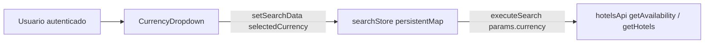

# Selección de moneda en el frontend

Este documento describe el objetivo y la implementación del selector de moneda que usa el usuario autenticado en la cabecera de la aplicación.

## Objetivo

- Permitir al usuario **elegir en qué moneda quiere ver y solicitar precios** en el flujo de búsqueda y disponibilidad de hoteles.
- La elección se almacena en el estado global de búsqueda (`selectedCurrency`) y se envía a la API como parámetro `currency` en las peticiones definidas en [`src/stores/useSearchStore.js`](../../src/stores/useSearchStore.js) (por ejemplo en `executeSearch` y `executeSearchHotelAvailability`).
- **Importante (UI)**: el componente visible del selector (`CurrencyDropdown`) **solo se muestra cuando el usuario está autenticado**. En [`src/components/AuthActions.jsx`](../../src/components/AuthActions.jsx) y [`src/components/AuthActionsMobile.jsx`](../../src/components/AuthActionsMobile.jsx) el import y el render de `CurrencyDropdown` están dentro de la rama `if (authenticated)`. Un invitado no ve el desplegable; el valor de `selectedCurrency` en el store puede seguir existiendo (persistido o por defecto) pero no lo cambia desde la cabecera.

## Flujo general

Tras actualizar el store, otros componentes reaccionan al cambio de `selectedCurrency` y vuelven a consultar la API cuando aplica (ver sección [Efectos al cambiar la moneda](#efectos-al-cambiar-la-moneda)).

## Implementación: `CurrencyDropdown`

Archivo: [`src/components/CurrencyDropdown.jsx`](../../src/components/CurrencyDropdown.jsx).

### Props

| Prop | Descripción |
|------|-------------|
| `className` | Clases CSS adicionales en el contenedor relativo del dropdown. Por defecto cadena vacía. |
| `isMobile` | Si es `true`, el botón ocupa ancho completo y el panel usa `w-full`; en escritorio el panel usa `min-w-[200px]`. |

### Fuente de datos

Las opciones provienen de [`src/data/currencies.json`](../../src/data/currencies.json). Cada entrada incluye `name`, `symbol` e `iso_code`.

Hay una opción especial **“Hotel currency”** con `iso_code` vacío y `symbol` igual a `king_bed`: en la UI se renderiza como icono de Material Symbols en lugar de un carácter de moneda.

### «Hotel currency»: qué guarda el store y qué va al API

- Al elegir esta opción, `selectedCurrency` queda como **cadena vacía** (`''`). Eso indica **modo visualización en moneda local del hotel**, no un ISO inválido para el proveedor.
- Las peticiones de disponibilidad no envían `currency` vacío: [`resolveAvailabilityCurrency`](../../src/lib/hotelRatePricing.js) sustituye ese valor por el ISO configurado en [`config.search.defaultCurrency`](../../src/config/config.js) (por defecto **`USD`**), que es lo que el backend/proveedor espera.
- La respuesta incluye a la vez importes en moneda pedida (`requested_currency_code`, `total_to_book_in_requested_currency`, `rate_in_requested_currency`) y en moneda del hotel (`currency_code`, `total_to_book`, `rate`). Con `selectedCurrency === ''`, la UI toma el segundo bloque vía [`getPricingForDisplay`](../../src/lib/hotelRatePricing.js) en listados y fichas; con cualquier otro ISO del selector, el primero.

### Comportamiento

1. **Estado local**: `isOpen` controla la visibilidad del panel de opciones.
2. **Clic fuera**: un `useEffect` registra `mousedown` en `document` y cierra el menú si el evento ocurre fuera del nodo referenciado por `dropdownRef`.
3. **Estado global**: el componente usa `useSearchStore()` para leer `searchData` y la acción `setSearchData`. Al elegir una fila, `handleCurrencySelect` hace merge de `searchData` con `selectedCurrency: currency.iso_code` y cierra el menú.
4. **Accesibilidad**: el botón que abre el menú expone `aria-expanded` y `aria-haspopup="true"`.
5. **Presentación**: en el botón se muestran símbolo (o icono) y código ISO; en la lista, símbolo (o icono) y nombre completo. La opción cuyo `iso_code` coincide con `searchData.selectedCurrency` recibe fondo distintivo (`bg-gray-100`).

## Store y persistencia

Archivo: [`src/stores/useSearchStore.js`](../../src/stores/useSearchStore.js).

- `searchStore` es un `persistentMap('searchStore', initialSearchData)` de `@nanostores/persistent`. El campo **`selectedCurrency` se persiste en el navegador** junto al resto de criterios de búsqueda (misma clave de almacenamiento que el mapa completo).
- El valor inicial en `initialSearchData` es `'USD'`.
- El hook `useSearchStore` mantiene copia en React mediante `useState` + suscripción a `searchStore` y `resultsStore`, y reexporta las acciones (`setSearchData`, `executeSearch`, etc.).

Al construir parámetros para la API, [`useSearchStore.js`](../../src/stores/useSearchStore.js) usa `currency: resolveAvailabilityCurrency(searchData.selectedCurrency)`, definido en [`src/lib/hotelRatePricing.js`](../../src/lib/hotelRatePricing.js) y apoyado en `config.search.defaultCurrency` ([`config.js`](../../src/config/config.js)).

## Integración en la cabecera

- **Escritorio**: [`src/components/AuthActions.jsx`](../../src/components/AuthActions.jsx) renderiza `<CurrencyDropdown />` (sin `isMobile`) junto a enlaces de cuenta y cierre de sesión cuando `authenticated` es verdadero.
- **Móvil**: [`src/components/AuthActionsMobile.jsx`](../../src/components/AuthActionsMobile.jsx) renderiza `<CurrencyDropdown isMobile={true} />` en la misma condición.

Ambos componentes sincronizan `authenticated` con eventos de ventana `auth:login`, `auth:logout` y `auth:tokenUpdated`.

## Efectos al cambiar la moneda

El dropdown solo escribe en el store; el refresco de datos lo disparan otros módulos:

- **[`src/components/SearchResults.jsx`](../../src/components/SearchResults.jsx)**: un `useEffect` depende de `searchData.selectedCurrency` (y del montaje del componente). Si ya existe `lastSearch`, vuelve a llamar a `executeSearch()` para repetir la búsqueda con la nueva moneda.
- **[`src/components/AvailableHotelRooms.jsx`](../../src/components/AvailableHotelRooms.jsx)**: otro `useEffect` depende de `searchData?.selectedCurrency` cuando hay `hotelData` y el usuario está autenticado; vuelve a ejecutar `executeSearchHotelAvailability()` para actualizar la disponibilidad del hotel en curso.

Otros componentes (por ejemplo listados de habitaciones o tarjetas de hotel) leen códigos y montos devueltos por la API y mapean símbolos con la misma tabla `currencies.json` cuando hace falta mostrar precios.

## Archivos relacionados

| Archivo | Rol |
|---------|-----|
| [`src/components/CurrencyDropdown.jsx`](../../src/components/CurrencyDropdown.jsx) | UI del selector y escritura de `selectedCurrency`. |
| [`src/components/AuthActions.jsx`](../../src/components/AuthActions.jsx) | Ubicación del selector en cabecera (usuario autenticado, desktop). |
| [`src/components/AuthActionsMobile.jsx`](../../src/components/AuthActionsMobile.jsx) | Ubicación del selector en menú móvil (usuario autenticado). |
| [`src/stores/useSearchStore.js`](../../src/stores/useSearchStore.js) | Estado persistente, `executeSearch`, `executeSearchHotelAvailability` y parámetro `currency`. |
| [`src/data/currencies.json`](../../src/data/currencies.json) | Catálogo de monedas y metadatos de presentación. |
| [`src/components/SearchResults.jsx`](../../src/components/SearchResults.jsx) | Re-ejecución de búsqueda al cambiar moneda. |
| [`src/components/AvailableHotelRooms.jsx`](../../src/components/AvailableHotelRooms.jsx) | Re-fetch de disponibilidad por hotel al cambiar moneda. |
| [`src/lib/hotelRatePricing.js`](../../src/lib/hotelRatePricing.js) | `resolveAvailabilityCurrency`, `getPricingForDisplay` y modo hotel vs solicitada. |
