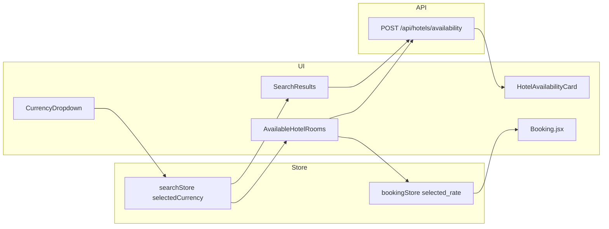

# Visualización de precios de hoteles y habitaciones

Este documento describe **cuándo** llegan los datos con precios desde el backend, **dónde** se renderizan en el frontend y **cómo** interviene la moneda seleccionada por el usuario.

> **Ruta del proyecto:** el código vive en `fe_traverwithgaston` (no `fe_travelwithgaston`).

## Resumen ejecutivo

- Los **importes** en la respuesta de disponibilidad vienen en **dos formas**: moneda pedida al API (`requested_currency_code`, `total_to_book_in_requested_currency`, `rate_in_requested_currency`) y moneda local del hotel (`currency_code`, `total_to_book`, `rate`). La UI elige qué bloque mostrar según `searchStore.selectedCurrency` (ver [`src/lib/hotelRatePricing.js`](../../src/lib/hotelRatePricing.js)).
- La **preferencia de moneda** del usuario se guarda en `searchStore` (`selectedCurrency`). Para las peticiones POST de disponibilidad, el cuerpo incluye `currency: resolveAvailabilityCurrency(selectedCurrency)` (si el usuario elige «Hotel currency», `selectedCurrency` es `''` y se envía **`USD`** al API).
- Al **cambiar la moneda** en el selector del header, si ya había una búsqueda ejecutada, se **vuelve a llamar** al endpoint de disponibilidad para refrescar precios.
- En la **ficha de hotel**, las habitaciones y tarifas solo se cargan en **cliente** y solo si el usuario está **autenticado**; al cambiar moneda se **repite** la petición de disponibilidad de ese hotel.
- Tras elegir habitación y tarifa, la página **`/booking`** muestra el **resumen de precios** leyendo lo guardado en `bookingStore` (no vuelve a pedir disponibilidad salvo otras acciones del flujo de pago).
- La página **`/checkout`** es otro flujo: **Stripe Embedded Checkout** para suscripción/membresía, **no** el resumen de precio de la estancia en hotel.

---

## Moneda seleccionada

| Elemento | Ubicación |
|----------|-----------|
| Estado | `searchStore` (`@nanostores/persistent`), campo `selectedCurrency` |
| Valor inicial | `USD` en `useSearchStore.js` |
| UI | `CurrencyDropdown.jsx` (header: `AuthActions.jsx` / `AuthActionsMobile.jsx`) |
| Catálogo de monedas (nombre, símbolo, ISO) | `src/data/currencies.json` |

Opción especial **«Hotel currency»** en el catálogo: `iso_code` vacío → `selectedCurrency === ''` en el store. El cliente envía **`currency: USD`** (vía `resolveAvailabilityCurrency` y `config.search.defaultCurrency`) y **muestra** `currency_code` / `total_to_book` / `rate`. Cualquier otro ISO del selector muestra los campos `requested_*`. Detalle en [`docs/currency/README.md`](../currency/README.md).

### Formato en pantalla

- **`HotelAvailabilityCard`**, **`HotelAvailabilityList`** (orden por precio) y **`AvailableHotelRooms`**: usan `getPricingForDisplay(..., searchData.selectedCurrency)`; el símbolo sale de `currencies.json` cuando el código ISO está en el catálogo.
- **`Booking.jsx`**: el resumen usa `getPricingForBookingSummary` con `bookingStore.rate_pricing_display` (`hotel_native` \| `requested`), rellenado en `processBooking` al pulsar «Book now».

Los números suelen formatearse con `Number(...).toLocaleString('en-US')` o equivalente.

---

## Origen de los datos (API)

| Acción | Método | Endpoint | Incluye `currency` en la petición |
|--------|--------|----------|-----------------------------------|
| Búsqueda con usuario logueado (disponibilidad + precios) | POST | `/api/hotels/availability` | Sí (cuerpo JSON) |
| Búsqueda sin login (lista de hoteles) | GET | `/api/hotels?...` | No |
| Disponibilidad de un hotel concreto (detalle / habitaciones) | POST | `/api/hotels/availability` | Sí |
| Datos estáticos del hotel (nombre, galería, texto…) | GET | `/api/hotels/:id` | N/A (sin precios de estancia) |

Cliente HTTP: `src/lib/http.js` (`hotelsApi.getAvailability`, `hotelsApi.getHotels`, `hotelsApi.getHotelById`).

### Campos habituales en la respuesta de disponibilidad

| Rol | Campos típicos |
|-----|------------------|
| Moneda solicitada al API (p. ej. USD) | `requested_currency_code`, `total_to_book_in_requested_currency`, `rate_in_requested_currency` |
| Moneda local del hotel | `currency_code`, `total_to_book`, `rate` |

- A nivel **hotel** en resultados de búsqueda: objeto `lowest_rate` con ambos juegos cuando el proveedor los expone.
- A nivel **habitación**: `room_types[]`, cada una con `lowest_rate` y `rates[]` con el mismo patrón dual.

---

## Por página Astro

### `src/pages/search.astro`

- La página solo monta el layout, `SearchFormWrapper`, filtros y **`SearchResults`** (`client:load`).
- **No** trae precios en el servidor: todo el listado depende del store y de `executeSearch` en cliente.

**Flujo:**

1. `SearchResults` llama a `executeSearch()` cuando aplica (p. ej. búsqueda por defecto si no hay login y aún no hay `lastSearch`).
2. Si el usuario **está autenticado**, `executeSearch` usa **`getAvailability`**: los hoteles incluyen precios en la moneda pedida.
3. Si **no** está autenticado, usa **`getHotels`**: lista de hoteles **sin** precios de disponibilidad; las tarjetas (`HotelCard` vía `HotelsList`) **no muestran importes**.
4. Si cambia `searchData.selectedCurrency` y existe `lastSearch`, un `useEffect` en `SearchResults` **vuelve a ejecutar** `executeSearch()` para refrescar precios (solo relevante cuando la búsqueda usa disponibilidad, es decir, usuario logueado).

### `src/pages/hotels/[id_hotel].astro`

- **Servidor:** `hotelsApi.getHotelById(id)` → contenido editorial del hotel (`hotelData`), **sin** precios de habitaciones.
- **Cliente:** `AvailableHotelRooms` con `parentHotelData={hotelData}`.

**Flujo de precios en habitaciones:**

1. Solo si **`isAuthenticated`**, `AvailableHotelRooms` llama a `executeSearchHotelAvailability()` (misma moneda y fechas que `searchStore`).
2. Esa acción hace POST a disponibilidad con `hotel_id`, fechas, ocupación, `currency`, filtros, etc., y toma el primer hotel del array de respuesta.
3. Un `useEffect` dependiente de `searchData.selectedCurrency` **repite** la petición al cambiar moneda (usuario autenticado).
4. Si no hay sesión, no hay llamada de disponibilidad en este bloque: se puede ver `MembershipCard` pero no listado de habitaciones con precios.

La navegación desde búsqueda hacia el detalle suele llevar query params de fechas/destino (`HotelAvailabilityCard` usa `buildSearchUrl`); el store debe estar alineado con esas fechas para que la disponibilidad sea coherente.

### `src/pages/booking.astro`

- Monta **`Booking.jsx`** (`client:load`) dentro de `AuthGuard`.
- Los precios **no** se obtienen de nuevo en esta pantalla para el resumen inicial: vienen del **`bookingStore`** (`useBookingStore.js`), rellenado en **`AvailableHotelRooms`** al pulsar «Book now» mediante `processBooking(...)`, que persiste `selected_rate` y `selected_room` (JSON) y **`rate_pricing_display`** (`hotel_native` si al reservar el usuario tenía «Hotel currency» en el header, si no `requested`).
- **`Booking.jsx`** muestra total y media por noche con `getPricingForBookingSummary(selected_rate, rate_pricing_display || 'requested')` (códigos e importes alineados con lo que vio en disponibilidad). El payload de creación de reserva sigue usando `total_to_book` en moneda local del hotel donde aplica el backend.
- Si el usuario cambia la moneda **después** de haber llegado a booking, el resumen sigue reflejando la tarifa ya guardada hasta que vuelva a elegir tarifa desde disponibilidad con la moneda deseada.

### `src/pages/checkout.astro` (fuera del pricing de estancia)

- **`CheckoutComponent`**: Stripe **Embedded Checkout** (`/api/stripe/create-checkout-session`) — pago de producto Stripe (p. ej. membresía), **no** el desglose de precio de hotel/habitación del flujo de reserva.

### Otras páginas relacionadas con precios

| Página / componente | Precios de hotel |
|---------------------|------------------|
| `src/pages/index.astro` (u otras con CMS) | **`FeaturedHotels.astro`**: contenido Directus (enlaces, copy); **no** calcula precios de API. |
| `search.astro` (usuario no logueado) | Lista sin importes en tarjetas. |

---

## Componentes React relevantes

| Componente | Rol respecto al pricing |
|------------|-------------------------|
| `SearchResults.jsx` | Orquesta carga y **re-búsqueda al cambiar moneda**; elige `HotelAvailabilityList` vs `HotelsList`. |
| `HotelAvailabilityList.jsx` | Lista de hoteles con disponibilidad; ordenación por el total **mostrado** (`parseDisplayTotal` + `selectedCurrency`). |
| `HotelAvailabilityCard.jsx` | Muestra precio mínimo del hotel según `getPricingForDisplay` y `searchData.selectedCurrency`. |
| `AvailableHotelRooms.jsx` | Habitaciones y tarifas con el mismo criterio de visualización; símbolo desde `currencies.json`. |
| `hotelRatePricing.js` | `resolveAvailabilityCurrency`, `getPricingForDisplay`, `getPricingForBookingSummary`. |
| `HotelCard.jsx` / `HotelsList.jsx` | Resultado para anónimos: **sin bloque de precio**. |
| `CurrencyDropdown.jsx` | Actualiza `selectedCurrency` en el store (dispara efectos anteriores). |
| `Booking.jsx` | Resumen de reserva con datos ya elegidos (incluye importes de la tarifa seleccionada). |

---

## Diagrama simplificado (usuario autenticado)

Para usuarios **no autenticados**, la rama de `SearchResults` va a `HotelsList` → `getHotels` → sin precios en tarjeta; en detalle de hotel, `AvailableHotelRooms` no obtiene disponibilidad hasta login (y rol según botones «Subscribe» / «Book»).

---

## Referencias de código

- Store y búsqueda: `src/stores/useSearchStore.js` (`executeSearch`, `executeSearchHotelAvailability`).
- Páginas con pricing de estancia: `src/pages/search.astro`, `src/pages/hotels/[id_hotel].astro`, `src/pages/booking.astro`. `src/pages/checkout.astro` es solo Stripe (membresía), no resumen de hotel.
- Reserva en memoria local: `src/stores/useBookingStore.js` (`processBooking` serializa `selected_rate` / `selected_room` y `rate_pricing_display`).
- Helpers de moneda e importes: `src/lib/hotelRatePricing.js`.

Si en el futuro se unifica el listado para anónimos con precios, habría que extender `getHotels` o usar disponibilidad pública y propagar `currency` de la misma forma que en `getAvailability`.
